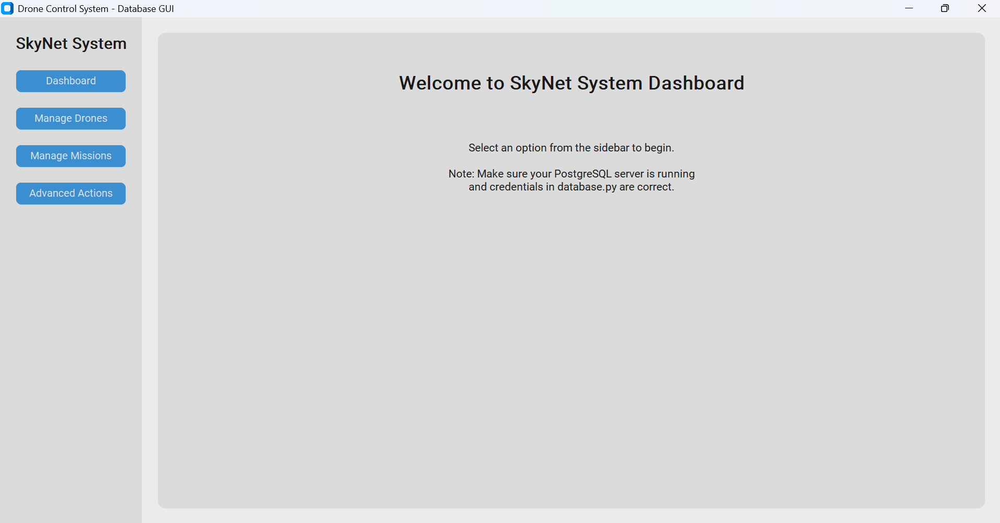
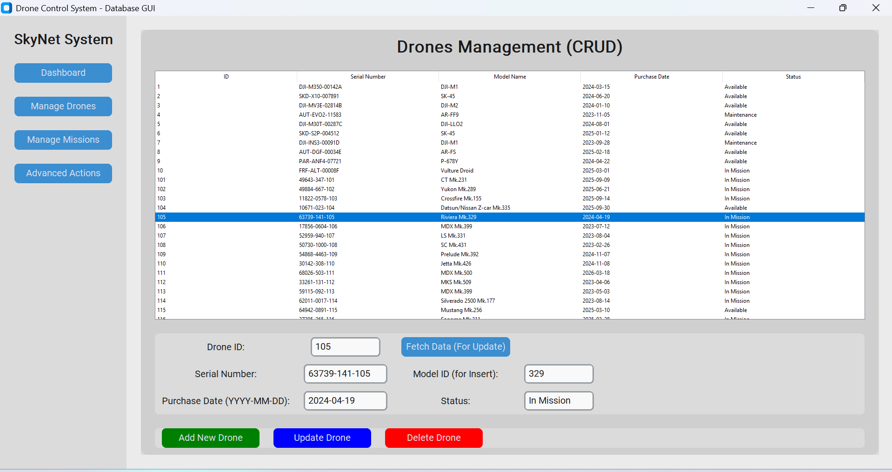
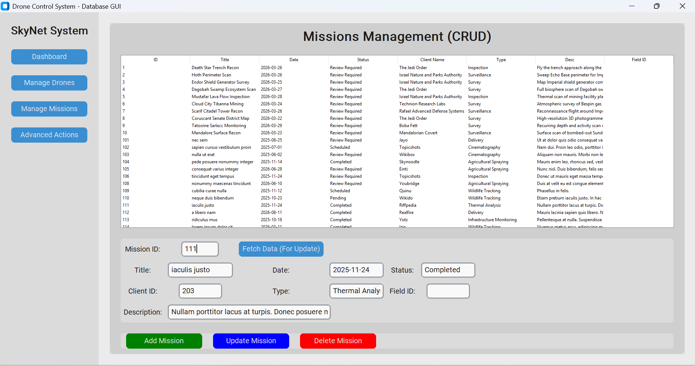
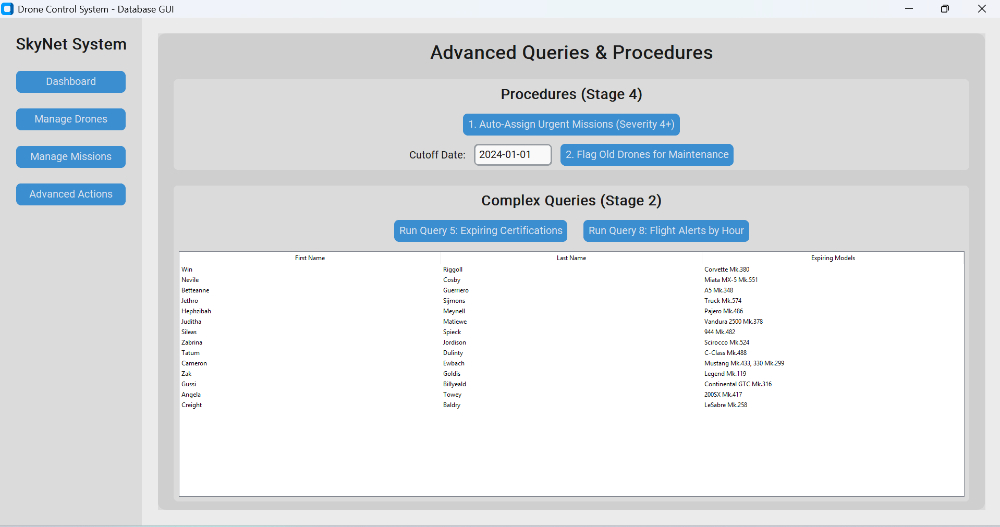

# דוח פרויקט - שלב ה' (ממשק גרפי למערכת רחפנים)

בשלב זה פיתחנו ממשק גרפי (GUI) המאפשר למשתמש קצה לגשת, לנהל ולהפעיל את בסיס הנתונים שלנו בקלות, מבלי לכתוב קוד SQL.

## הוראות הפעלה וכניסה למערכת
כדי להפעיל את המערכת, יש לוודא שמותקנות ספריות הפייתון הנדרשות:
```bash
pip install customtkinter psycopg2
```
1. פתח את הקובץ `database.py` וודא שפרטי ההתחברות (user, password, host, port) מעודכנים לשרת שלך.
2. הרץ את הקובץ הראשי מהטרמינל (בתוך תיקיית `שלב ה`):
```bash
python main.py
```
3. חלון האפליקציה ייפתח. תוכל לנווט באמצעות התפריט השמאלי בין המסכים השונים.

## הכלים ששימשו לפיתוח ודרך העבודה
את המערכת בחרנו לפתח בשפת **Python**. שפה זו נבחרה בזכות קריאות הקוד שלה, הפשטות, והתמיכה המצוינת בספריות חיצוניות.

*   **GUI (ממשק משתמש):** השתמשנו בספריית `customtkinter`. זוהי מעטפת מודרנית לספריית ה-Tkinter המסורתית. היא מאפשרת עיצוב נקי ויפהפה, תמיכה במצב לילה/יום (Dark/Light mode), רדיוסים עגולים לכפתורים, וקומפוננטות שנראות כמו אפליקציה עדכנית לכל דבר.
*   **Database (מסד נתונים):** השתמשנו בספריית `psycopg2` כדי לנהל את הגישה ל-PostgreSQL. בנינו מחלקת `Database` מרכזית שעוטפת את כל השאילתות, מטפלת בשגיאות, ודואגת להתחברות ולניתוק מסודרים.
*   **ארכיטקטורה:** כדי לשמור על קוד נקי ותחזוקתי, המערכת חולקה למספר קבצים:
    *   `main.py`: המסגרת החיצונית ותפריט הניווט.
    *   `database.py`: חיבור ללוגיקת הנתונים.
    *   `gui_drones.py` & `gui_missions.py`: מחלקות המטפלות במסכי ה-CRUD, עם שילוב של `JOIN` כדי להציג שמות במקום מזהים.
    *   `gui_advanced.py`: מסך המרכז הרצת שאילתות משלב ב' (מוזרקות אוטומטית לטבלה דינמית) והפעלת פרוצדורות משלב ד'.

## צילומי מסך של המערכת בפעולה

### מסך ראשי (Dashboard)


### ניהול רחפנים (CRUD)
*ניתן לראות את הצגת שם המודל במקום מזהה, ואת השדות לעדכון חכם.*


### ניהול משימות (CRUD)
*ניתן לראות את הצגת שם הלקוח במקום המזהה שלו.*


### מסך פעולות מתקדמות (שאילתות ופרוצדורות)
*מסך שבו הופעלה שאילתה משלב ב' / פרוצדורה משלב ד'.*


---
*הוגש כחלק מפרויקט בסיסי נתונים, שלב ה'*
